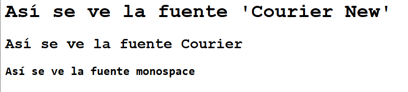
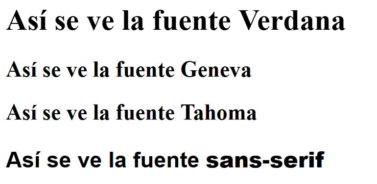
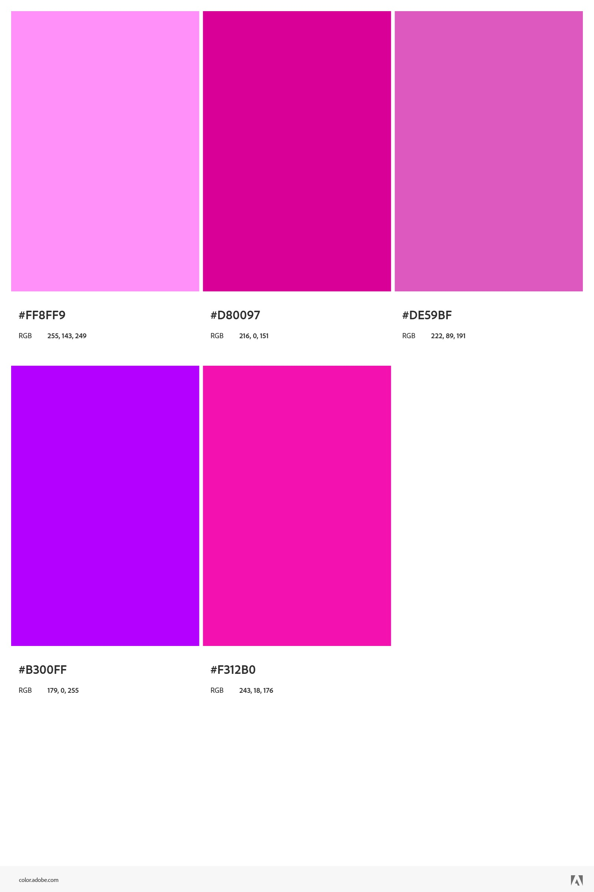

# web-estática
- Contexto: La idea de *farolas inteligentes* busca modernizar la iluminación de las ciudades y pueblos mediante la tecnología IoT, sensores y conectividad a la red. Con el objetivo de optimizar el consumo energético, mejorar la seguridad en las calles,... Tranformando radicalmente la infraestructura urbana de manera que sea más eficiente y más sostenible. 
- Autor: María Zihan Aguirrebalzategui Erce
- Redes Sociales utilizadas:
    - [Facebook](https://www.facebook.com/cipcuatrovientos/)
    - [Instagram](https://www.instagram.com/cipcuatrovientos/?hl=es)
    - [LinkedIn](https://www.linkedin.com/onboarding/start/profile-location/new/?session_redirect=https%3A%2F%2Fwww.linkedin.com%2Fcompany%2F4994017%2Fadmin%2Ffeed%2Fposts%2F&source=coreg)
    - [Página web](https://cuatrovientos.org/)
- Fuente:
    - Heading: 'Courier New', Courier, monospace

    - Body: Verdana, Geneva, Tahoma, sans-serif

        - NOTA: Hay varia fuentes pero solo son las primeras las que se visualizan. Las demás sirve por si en el navegador ese tipo de fuente no esta disponible. Van en orden de izquierda a derecha.
        Además, no lo he hecho con Google Fonts porque alguna de estas fuentes no aparecen. 
 
- Colors:
    -  #ff8ff9
    -  #f312b0
    -  #b300ff
    -  #de59bf5c
    -  #d80097
